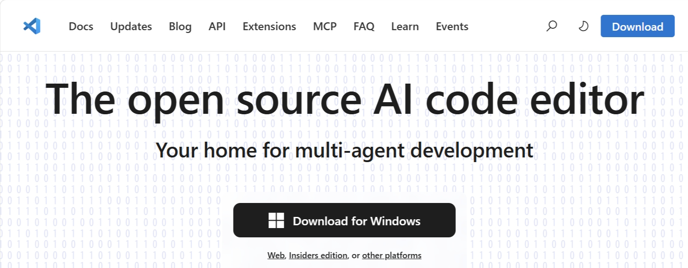
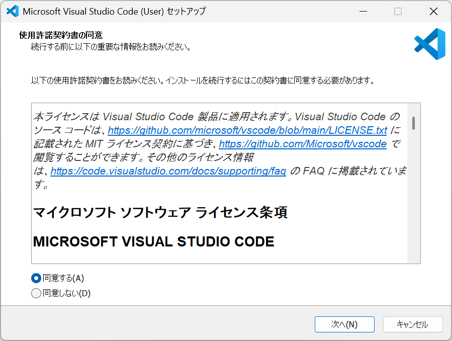

# 第1章：VSCodeを準備しよう（Windows編）

この章では、プログラミングを始めるための「道具箱」である **Visual Studio Code (VSCode)** を自分のパソコンへインストールします。

## 1. インストーラーをダウンロードする

1. [VSCode公式サイト](https://code.visualstudio.com/)へアクセスします。

   

2. **「Download for Windows」** ボタンをクリックします。
    * ※今回は **User Installer** 版を使用します。これは、パソコンの管理権限（管理者パスワード）がなくてもインストールしやすいためです。

## 2. インストールの手順（重要！）

ダウンロードしたファイルを実行すると、セットアップ画面が表示されます。以下の手順で進めてください。

1. **使用許諾契約の同意:** 「同意する」を選択して「次へ」。

   

2. **インストール先の指定:** そのまま「次へ」。
3. **スタートメニューフォルダの指定:** そのまま「次へ」。
4. **追加タスクの選択（ここがポイント！）:**
    画面にある **全てのチェックボックスにチェック** を入れてください。
    * [x] デスクトップ上にアイコンを作成する
    * [x] エクスプローラーのファイルコンテキストメニューに[Codeで開く]アクションを追加する
    * [x] エクスプローラーのディレクトリコンテキストメニューに[Codeで開く]アクションを追加する
    * [x] サポートされているファイルの種類のエディターとして、Codeを登録する
    * [x] PATHに追加する（再起動後、有効になります）
    > **💡 なぜ全部チェックするの？**
    > 「Codeで開く」をチェックすると、フォルダやファイルを右クリックしてすぐにVSCodeで開けるようになり、皆さんの作業がとても楽になるからです。
5. **インストールの実行:** 「インストール」ボタンを押し、完了したら「完了」をクリックしてVSCodeを起動します。

## 3. 画面を日本語にする

起動直後はメニューが全て英語になっています。日本語に直しましょう。

1. 左端にある **「Extensions」アイコン**（四角が4つ並んだマーク）をクリックします。
2. 検索バーに `Japanese` と入力します。
3. **「Japanese Language Pack for Visual Studio Code」** を見つけ、**[Install]** をクリックします。
4. 右下に「Change Language and Restart」というボタンが出たら、それをクリックして再起動します。

## 4. 画面の各部分の名前

これから説明でよく使う名前です。少しずつ覚えましょう。

* **サイドバー（左側）:** ファイルを探したり、拡張機能を入れたりする場所。
* **エディター（中央）:** プログラムやHTMLを書くメインの場所。
* **パネル（下側）:** 実行結果やエラーメッセージが表示される場所。
* **ステータスバー（一番下）:** 現在の状態（文字コードなど）が表示される場所。

---
